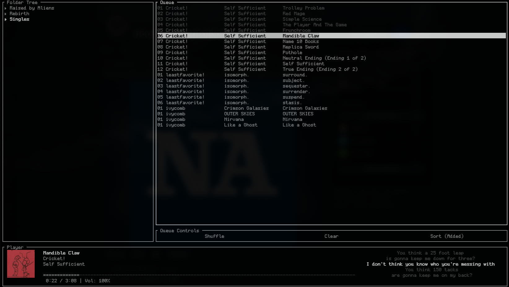

<div><h6>please don't sue me game freak</h6><h2>A TUI music player that does music player things.</h2></div>

a "lightweight" "simple" "easy-to-use" "TUI" (sorry i gotta get my keywords in) music player that does such revolutionary things as:
1. Play music
2. Display Lyrics
3. Display Cover Art

You can even shuffle songs! Wow!<br><br>

Jokes aside, it's a visually minimalist, sorta-not-really-feature-rich, TUI music player built with Ratatui and based on libmpv for playback and Lofty for metadata. You have three (technically four) panels:
- Folder tree, for looking at folders and adding music 
- Queue, for managing the next and previously played songs. Comes with an extra not-really-panel for shuffle/clear/sort.
- Player, which shows cover art, metadata, progress, and lyrics if applicable.

Audino is intended to push past the strange keybinds, outdated format support, un-gapless playback,and other issues that plague TUI music players to this day.

It looks like this:

<h6>uses terminal font, pictured is <a href="https://github.com/qwerasd205/PixelCode">pixel code</a></h6>

## Installation/Usage
Unfortunately even with the wondrous power of AI, I'm scared and clueless and afraid as to releasing and packaging an application. So, in order to install this, you're gonna need to build it yourself:

1. Clone the repo: `git clone git@github.com:4c-ee/audino.git`
OR **download the source code from the releases for a stable version**, I'll try not to leave stuff completely unfinished for too long though lol

2. Make sure you have cargo installed (usually supplied by the `rust` package) and your working directory is the place you extracted it
3. Run `cargo build -r`
4. Move the built binary from `target/release/audino` to `/usr/sbin/` (may need sudo) or wherever most of your commands are in
5. Then run audino from anywhere!! It will default to ~/Music, but you can back out of that. No you can't change that default opening directory why do you ask

To use it, run `audino` from your terminal. 

Press Tab to flip between the panels:
1. Folder tree:
   * Arrow keys: Up/down changes the highlighted directory or file, left/right goes in/out of the highlighted and current directory. 
   * Enter: Add highlighted folder or file to queue. Will start playing as soon as any songs are added.
2. Queue:
   * Arrow keys: Up/down to highlight tracks.
   * Enter: Play highlighted track.
   * Space: Rearrange queue. Will "Pick up" higlighted track and move it with arrow keys. Space to put it down.
   * D: Delete track from queue
   * Queue controls: L/R arrow keys to highlight, enter to activate.
3. Player:
   * Space: Play/pause.
   * Arrow keys: Up/down to adjust volume, left/right to skip back/forward five seconds.
     
Press Q to exit.

## Configuration

Make a config file at `~/.config/audino/audino.conf`. It's simply key=value. An example/default with all of the options can be found at audino.conf.example

---
## DISCLAIMER
The majority of this code was generated with AI. A Rust ratatui project with a simple premise and terrible execution? Did you expect it to be _not_ vibecoded??

You're free to make your own, or use one of many alternatives out there.

I don't claim to make this, the various LLMs I used did. I'm basically just a product manager atp. I did the branding, the publicity, etc. But they're the programmers.


> [!CAUTION]
>Are you willing to trust an AI to run code on your computer? To trust me? 
>
>Do you have the knowledge to read and understand this source code and/or the AUR PKGBUILD? I know it contains no viruses, but do you?
>
>If the answer is "no" to all, you should find out how to say yes to one or more of them, then download it :)

---
```
Copyright 2026 4c-ee

Licensed under the Apache License, Version 2.0 (the "License");
you may not use this file except in compliance with the License.
You may obtain a copy of the License at

   http://www.apache.org/licenses/LICENSE-2.0

Unless required by applicable law or agreed to in writing, software
distributed under the License is distributed on an "AS IS" BASIS,
WITHOUT WARRANTIES OR CONDITIONS OF ANY KIND, either express or implied.
See the License for the specific language governing permissions and
limitations under the License.
```
